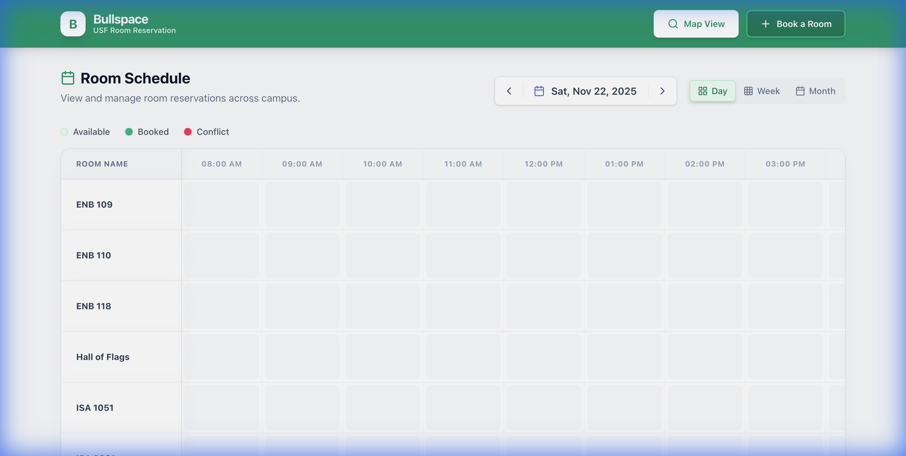
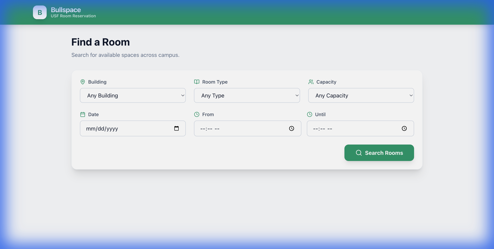
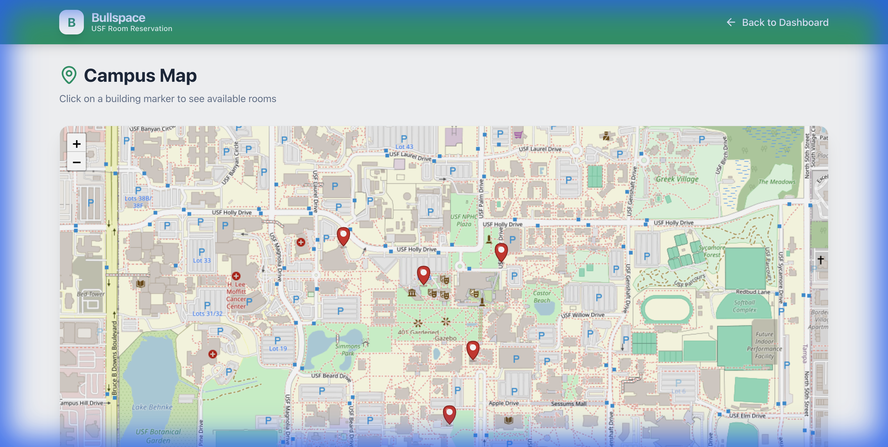
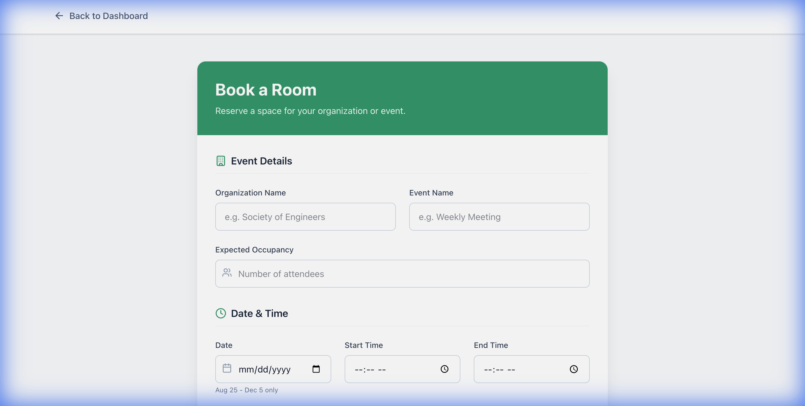

# 🏫 Bullspace - USF Room Reservation System

**Bullspace** is a comprehensive room reservation platform designed for the University of South Florida campus. Built for HackJam (Hackathon), this web application streamlines the process of finding, booking, and managing campus study spaces with an intuitive interface and real-time availability tracking.



## ✨ Features

### 📅 **Multi-View Dashboard**
- **Day View**: See all rooms and their hourly availability at a glance
- **Week View**: Plan ahead with a 7-day schedule for specific rooms
- **Month View**: Get a bird's-eye view of booking patterns
- Interactive navigation with date pickers and view switchers

### 🔍 **Smart Search & Booking**
- Advanced filtering by building, capacity, and amenities
- Real-time availability checking across all campus locations
- Conflict detection to prevent double-bookings
- One-click booking with instant confirmation



### 🗺️ **Interactive Map View**
- Visual campus map powered by Leaflet
- Pin markers showing building locations
- Click on buildings to see available rooms
- Scrollable room cards with quick booking access



### 📋 **Booking Management**
- Review and confirm booking details before submission
- View all room information (capacity, amenities, location)
- Easy-to-read booking summaries
- Responsive design for mobile and desktop



## 🛠️ Tech Stack

- **Frontend Framework**: React 19.2.0
- **Build Tool**: Vite 7.2.4
- **Routing**: React Router DOM 7.9.6
- **Styling**: TailwindCSS 4.1.17 (with PostCSS & Autoprefixer)
- **Map Integration**: Leaflet 1.9.4 + React Leaflet 5.0.0
- **Icons**: Lucide React 0.554.0
- **Date Handling**: date-fns 4.1.0
- **Code Quality**: ESLint 9.39.1

## 🚀 Getting Started

### Prerequisites
- Node.js (v16 or higher recommended)
- npm or yarn package manager

### Installation

1. **Clone the repository**
   ```bash
   git clone <repository-url>
   cd "julio final branch"
   ```

2. **Install dependencies**
   ```bash
   npm install
   ```

3. **Run the development server**
   ```bash
   npm run dev
   ```

4. **Open your browser**
   - Navigate to `http://localhost:5174`
   - The app should be running with hot module replacement enabled

### Available Scripts

- `npm run dev` - Start development server with hot reload
- `npm run build` - Create production build
- `npm run preview` - Preview production build locally
- `npm run lint` - Run ESLint for code quality checks

## 📁 Project Structure

```
julio final branch/
├── src/
│   ├── components/     # Reusable UI components
│   ├── pages/          # Route pages (Dashboard, Search, Booking, Map)
│   ├── context/        # React Context for state management
│   ├── data/           # Mock data (rooms.json)
│   ├── utils/          # Helper functions and utilities
│   └── App.jsx         # Main application component
├── public/             # Static assets
├── mock_db.json        # Mock database for bookings
├── package.json        # Dependencies and scripts
└── vite.config.js      # Vite configuration
```

## 🎯 Key Functionality

### Room Booking Flow
1. **Search**: Filter available rooms by criteria (building, capacity, amenities)
2. **Select**: Choose a room that meets your needs
3. **Book**: Pick a date and time slot
4. **Confirm**: Review details and confirm your reservation

### Dashboard Features
- **Real-time Grid**: Visualize all rooms and their hourly bookings
- **Color-coded Status**: Green for booked, red for conflicts, white for available
- **Quick Actions**: Navigate to booking or map view with one click
- **Responsive Calendar**: Switch between day, week, and month views seamlessly

### Map Integration
- **Interactive Campus Map**: Powered by OpenStreetMap via Leaflet
- **Building Markers**: Custom pins for each campus building
- **Room Popup Cards**: Click buildings to see available rooms with details
- **Direct Booking**: Book rooms directly from the map interface

## 📊 Data Structure

The application uses a mock database (`mock_db.json`) for bookings and `rooms.json` for room information. Each room includes:
- Room name and ID
- Building location with GPS coordinates
- Capacity and amenities
- Availability status

## 🎓 Hackathon Information

- **Event**: HackJam
- **Purpose**: Simplify campus room reservations for students
- **Development Time**: Built during the hackathon
- **Team**: [Add your team members here]

## 🔮 Future Enhancements

- [ ] User authentication and profiles
- [ ] Email/SMS booking confirmations
- [ ] Integration with USF's actual room database
- [ ] Mobile app version (React Native)
- [ ] Calendar export (iCal/Google Calendar)
- [ ] Room popularity analytics

## 📸 Screenshots

### Dashboard - Day View


### Search & Filter


### Booking Confirmation


### Interactive Map


## 📝 License

This project was created for educational purposes during a hackathon.

## 🙏 Acknowledgments

- University of South Florida for inspiring this project
- OpenStreetMap contributors for map data
- Leaflet.js for the amazing mapping library
- The hackathon organizers and mentors

---

**Built with ❤️ for USF students**
